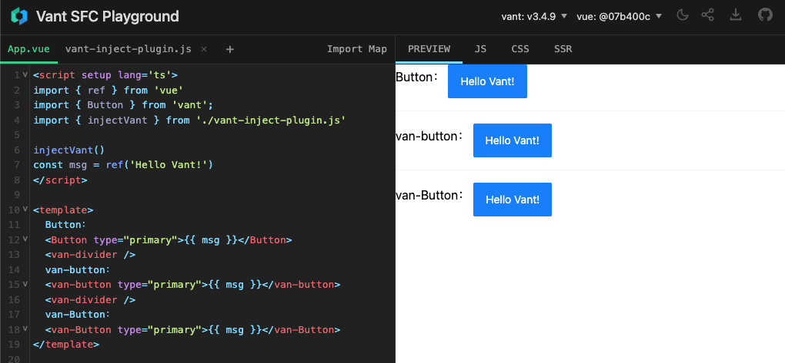

# SFC Playground with Vant

> This is an Vant SFC Playground. Detail [vercel.app](https://sfc-playground-vant.vercel.app/) Or [zhixiaoqiang.github.io](https://zhixiaoqiang.github.io/sfc-playground-vant/)



## What's inside?

Try Vant in the Playground. Currently only Vant 3+ is supported

### Utilities

This turborepo has some additional tools already setup for you:

- [pnpm](https://pnpm.io) as a packages manager
- [TypeScript](https://www.typescriptlang.org/) for static type checking
- [ESLint](https://eslint.org/) for code linting
- [Prettier](https://prettier.io) for code formatting
- [Vant](https://vant-contrib.gitee.io/vant) a Lightweight Mobile UI Components built on Vue
- [@vue/repl](https://github.com/vuejs/repl) for Vue SFC REPL as a Vue 3 component

## Get Started

0. Click `Use this template`, and clone your repo `git clone https://github.com/zhixiaoqiang/sfc-playground-vant --depth 1`.
1. config `src/config.ts`、`src/store.ts` and `src/components/npm-version-switch/helps.ts`.

then it'll be your repository totally.

### Build

To build the playground, run the following command:

```bash
pnpm build
```

### Develop

To develop the playground, run the following command:

```bash
pnpm dev
```

### Create Changelog

1. Execute `pnpm changeset` to add a changeset.
2. Execute `pnpm changeset version` to change `CHANGELOG.md`.
3. Execute `pnpm changeset publish` to publish `npm library`. [can skip]
4. Execute `git commit`, this command will trigger `lint-staged` and `commitzen`.
5. Execute `git push` to trigger `Github Actions` or `vercel Deploy`
<!-- 3. If you create a PR merge to main, `changeset/actions` will create a `Version Packages` PR. confirm merge `Version Packages` PR will trigger `changeset publish`, it's really publish. -->

### CHANGELOG

Please refer to [CHANGELOG](https://github.com/zhixiaoqiang/sfc-playground-vant/blob/main/CHANGELOG.md) for details.
## License

MIT
